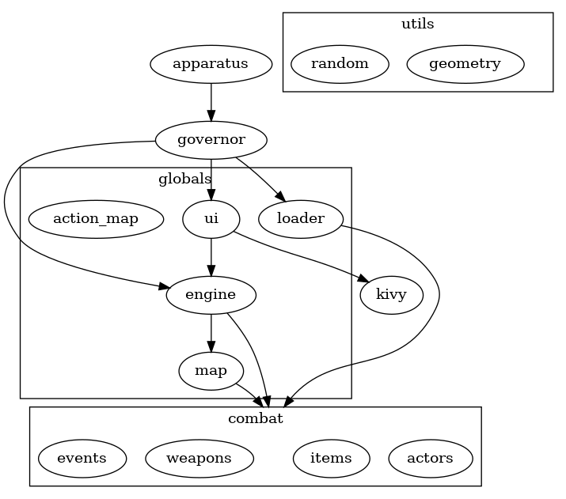

Developing Revengate
====================

## Dependencies
The pure Python dependencies are specified in `requirements-dev.txt`. 

If you are not already using a virtual environment, it's a good idea to create one now: 
```sh-session
$ python3 -m venv .venv
. .venv/bin/activate
```

This command should then install all the development dependencies for you:
```sh-session
$ pip install -r requirements-dev.txt
```

You can see if your setup is working by installing the game in development mode and then launching it: 
```sh-session
$ flit install -s
$ revcli
```

There are many non-Python dependencies, almost all for the Android backend. If you do not plan on deploying the game on Android, you don't have anything else to do!

On Ubuntu 21.10, this command will get you up to speed for Android development:

```sh-session
$ sudo apt install -y build-essentials cmake java-common default-jre default-jdk \
  and libjffi-java google-android-build-tools-24-installer android-sdk-build-tools \
  android-sdk-platform-tools android-sdk-platform-23 android-sdk libltdl7-dev lld
```

It's probably possible to simplify this list, but the errors you get come very late and are rather cryptic, so we didn't get into simplifying it yet.

More details are available in the [Kivy official documentation][kivy-for-a]

[kivy-for-a]: https://buildozer.readthedocs.io/en/latest/installation.html#targeting-android

Buildozer also fails to auto-download our target Android NDK, so you should download it manually:

```sh-session
$ cd ..
$ wget https://dl.google.com/android/repository/android-ndk-r23b-linux.zip
$ unzip android-ndk-r23b-linux.zip
```

You can test your Android development setup by plugging an Android device over USB then typing: 
```sh-session
$ buildozer android debug deploy run
```

This command will take up to 30 mins the first time, less then a minute after that. The mobile device must have [USB-debugging enabled][usb-debug]. 

[usb-debug]: https://developer.android.com/studio/command-line/adb#Enabling

### Alternate: manage depenencies with Guix

If you prefer to use [Guix](guix.gnu.org/) rather than pip+virtualenv, use the
provided [manifest](../manifest.scm). For example, you can launch the game like so:

```sh-session
$ guix shell -m manifest.scm -- python3 -m revegate.apparatus
```

You can add the directory to your "safe directories" list to avoid having to even type `-m manifest.scm`- to do so:

```sh-session
$ echo $PWD >> $HOME/.config/guix/shell-authorized-directories
```


## Coding style and conventions
* max line length is 88
* pos, which stands for position is always an (x, y) tuple in carterian coordinates (origin at bottom left corner).
* tile: what the environment is made of at a given pos (floor, wall, door, ...)
* funct, not func: a Python callable
* action and ftag: a string referencing a registered Python function; must be resolved before it can be called
* params, not parms
* hero: the player character, never referrer to as PC
* dialog: a popup window, when possible, use "form" or "popup" instead 
* dialogue: a conversation between actors or a speech by the narrator 
* when in doubt, name things after steam engine parts or concepts at the core of the industrial revolution


## UI paradigms
* prompt: a function to all for a user response. It can be a direct question or just a change to the environment that invites for some user input that may never come
* response: the callback function to a prompt. The callback might be registered for a single call or for every occurrences of the target user input.

## User Experience
* go with the [Material Design](https://material.io/) guidelines unless they interfere with a good game experience.

## Actions and turns
If an actor does something that counts as an action, they should be `set_played()` to 
avoid giving them the opportunity to do something else during the same turn. Most of 
the times, the actor should do it themselves, but there are a few actions that require 
more global context to be performed, such as entering a new map or dungeon. In those 
cases, the governor is the best place to call `actor.set_played()`. Calling it 
additional times during the same turn is a no-op, so when it doubt, just call it.


## Code structure
The main layers of the code are in described below:




## Artwork
Artwork must be licensed under one of CC-BY, CC-BY-SA (4.0+), CC0, or GPLv3. 

CC-NC and CC-NC-SA are not GPL compatible and are therefore not usable in this project. More details here:
https://creativecommons.org/share-your-work/licensing-considerations/compatible-licenses
https://fedoraproject.org/wiki/Licensing:Main?rd=Licensing#Content_Licenses
https://help.ubuntu.com/community/Repositories/Ubuntu

